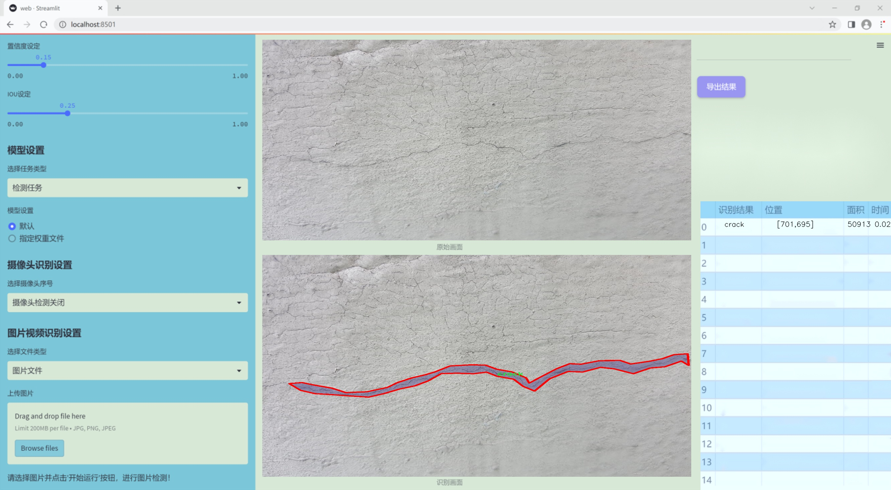
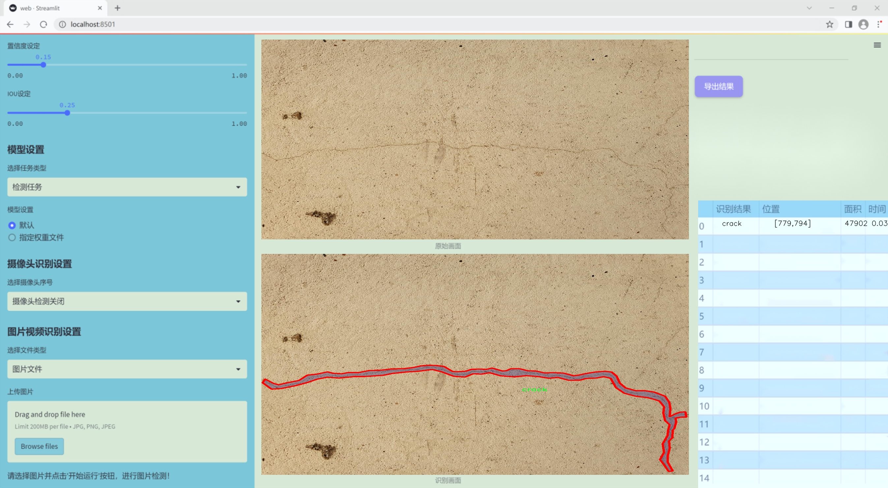
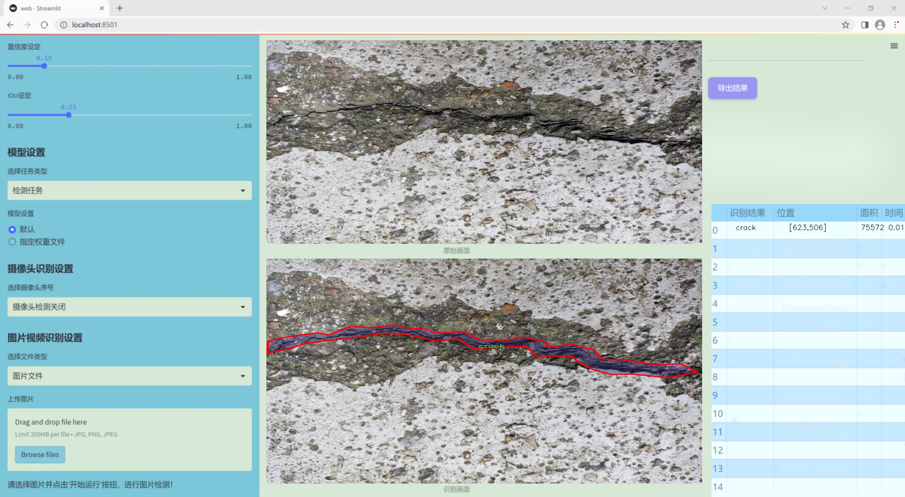
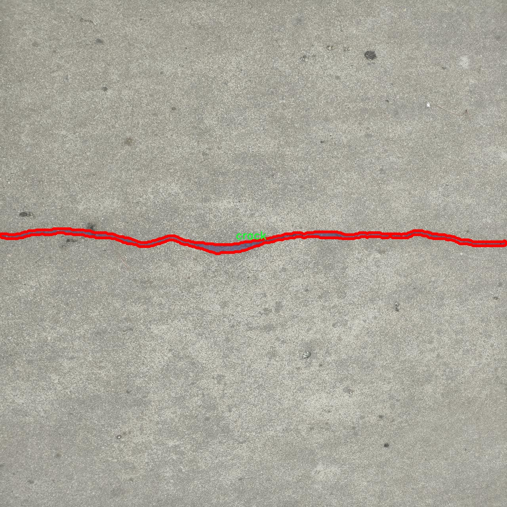
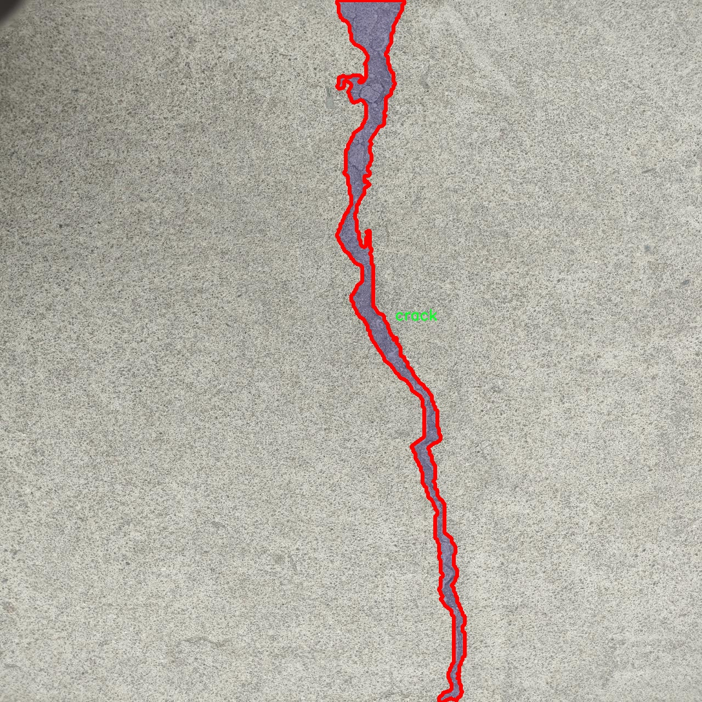
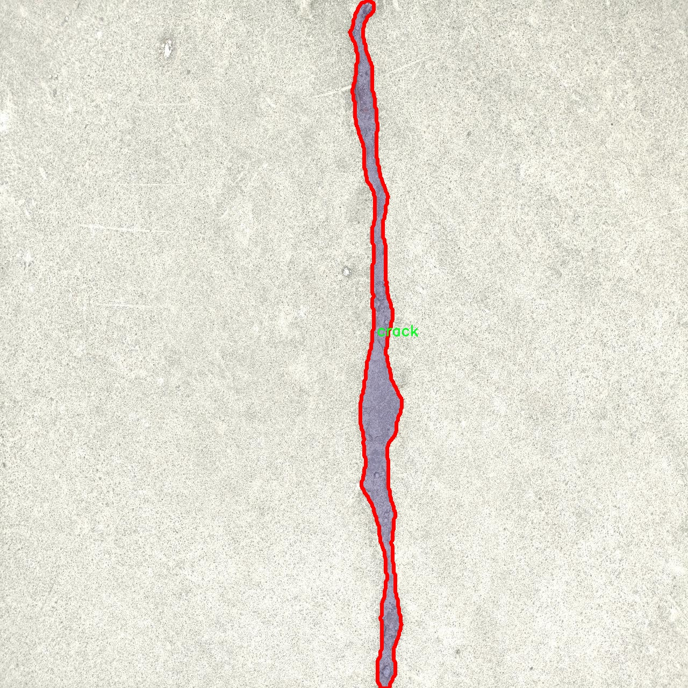
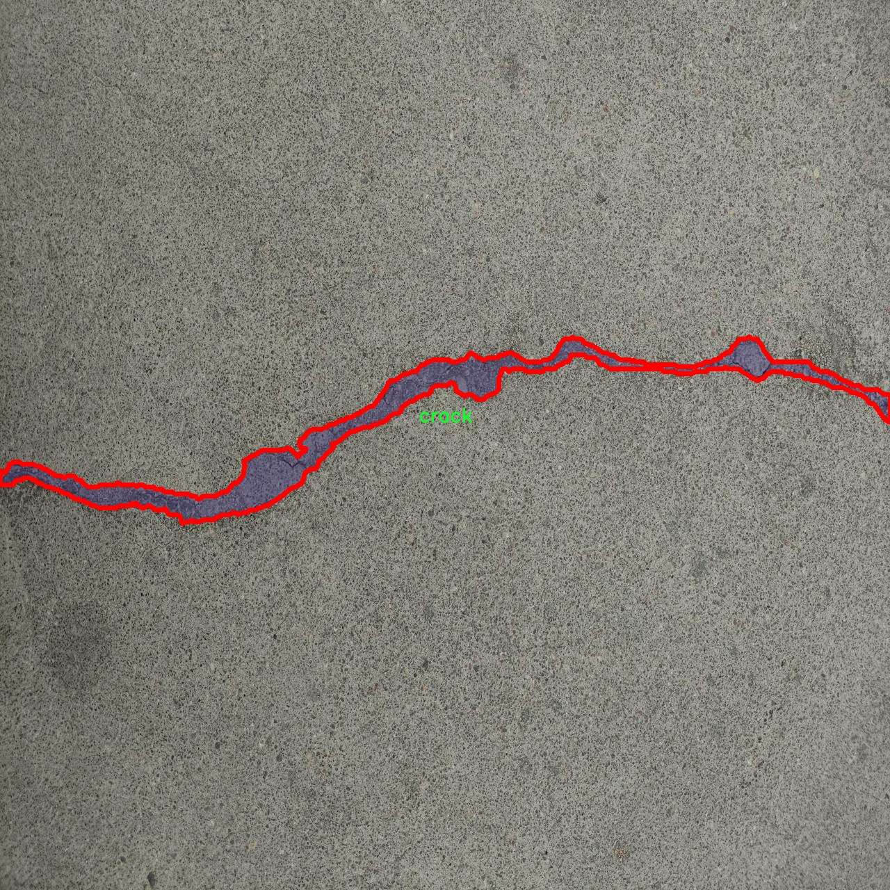
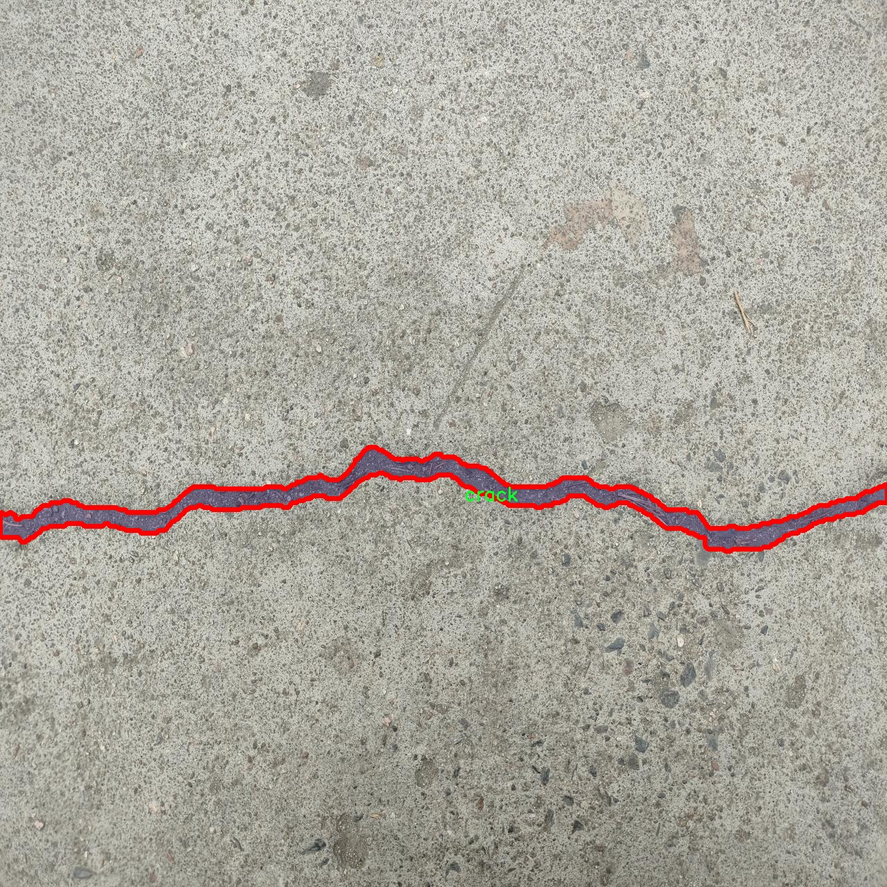

### 1.背景意义

研究背景与意义

随着城市化进程的加快，桥梁作为重要的交通基础设施，其安全性和可靠性愈发受到重视。桥梁的结构损伤，尤其是裂缝的出现，往往是导致桥梁失效的前兆。因此，及时、准确地检测和评估桥梁裂缝，对于确保交通安全和延长桥梁使用寿命具有重要意义。传统的桥梁检测方法多依赖人工巡检，不仅效率低下，而且容易受到人为因素的影响，导致漏检或误检现象的发生。随着计算机视觉技术的快速发展，基于深度学习的自动化检测方法逐渐成为研究热点。

本研究旨在基于改进的YOLOv11模型，构建一个高效的桥梁裂缝检测系统。YOLO（You Only Look Once）系列模型以其实时性和高准确率在目标检测领域中表现突出。通过对YOLOv11进行改进，我们希望能够提升其在桥梁裂缝检测中的性能，尤其是在复杂环境下的检测能力。为此，我们使用了包含1900张标注图像的数据集，该数据集专注于桥梁裂缝的实例分割，提供了丰富的训练样本和多样的裂缝特征。

数据集的构建和预处理过程为模型的训练提供了坚实的基础。通过对图像进行增强处理，如随机翻转和亮度调整，能够有效提高模型的泛化能力。此外，数据集中的裂缝标注采用YOLOv8格式，确保了与YOLO系列模型的兼容性。通过这些技术手段，我们期望实现对桥梁裂缝的高效、准确检测，从而为桥梁的维护和管理提供科学依据。

综上所述，本研究不仅具有重要的理论价值，也为实际工程应用提供了切实可行的解决方案。通过改进YOLOv11模型，我们希望能够推动桥梁检测技术的发展，提高公共基础设施的安全性，最终实现更高效的城市交通管理。

### 2.视频效果

[2.1 视频效果](https://www.bilibili.com/video/BV1hPqAYtE8K/)

### 3.图片效果







##### [项目涉及的源码数据来源链接](https://kdocs.cn/l/cszuIiCKVNis)**

注意：本项目提供训练的数据集和训练教程,由于版本持续更新,暂不提供权重文件（best.pt）,请按照6.训练教程进行训练后实现上图演示的效果。

### 4.数据集信息

##### 4.1 本项目数据集类别数＆类别名

nc: 1
names: ['crack']


该项目为【图像分割】数据集，请在【训练教程和Web端加载模型教程（第三步）】这一步的时候按照【图像分割】部分的教程来训练

##### 4.2 本项目数据集信息介绍

本项目数据集信息介绍

本项目所使用的数据集名为“bridge cracktest01”，旨在为改进YOLOv11的桥梁裂缝检测系统提供高质量的训练数据。该数据集专注于桥梁结构的完整性监测，尤其是裂缝的识别与分类。数据集中包含的类别数量为1，具体类别为“crack”，即裂缝。这一单一类别的设计使得模型能够专注于识别和定位桥梁上的裂缝，从而提高检测的准确性和效率。

在数据集的构建过程中，特别注重了数据的多样性和代表性。收集的图像涵盖了不同类型的桥梁结构，包括但不限于钢桥、混凝土桥和悬索桥等。每张图像均经过精心标注，确保裂缝的边界清晰可见，且标注的准确性经过多次审核，以避免误标和漏标现象。此外，数据集中还包含了不同光照条件、天气状况和视角下的桥梁裂缝图像，以增强模型的鲁棒性和适应性。

为了确保模型在实际应用中的有效性，数据集还考虑了裂缝的不同尺寸和形态，包括细小的裂缝和较大的裂缝，这为模型提供了丰富的学习样本。通过这种方式，期望训练出的YOLOv11模型能够在实际桥梁检测中，快速、准确地识别出潜在的裂缝问题，从而为桥梁的维护和安全评估提供有力支持。

总之，“bridge cracktest01”数据集不仅为YOLOv11的训练提供了坚实的基础，也为未来的桥梁检测技术发展奠定了重要的参考价值。通过对这一数据集的深入研究与应用，期待能够在桥梁安全监测领域取得更大的突破。











### 5.全套项目环境部署视频教程（零基础手把手教学）

[5.1 所需软件PyCharm和Anaconda安装教程（第一步）](https://www.bilibili.com/video/BV1BoC1YCEKi/?spm_id_from=333.999.0.0&vd_source=bc9aec86d164b67a7004b996143742dc)


[5.2 安装Python虚拟环境创建和依赖库安装视频教程（第二步）](https://www.bilibili.com/video/BV1ZoC1YCEBw?spm_id_from=333.788.videopod.sections&vd_source=bc9aec86d164b67a7004b996143742dc)

### 6.改进YOLOv11训练教程和Web_UI前端加载模型教程（零基础手把手教学）

[6.1 改进YOLOv11训练教程和Web_UI前端加载模型教程（第三步）](https://www.bilibili.com/video/BV1BoC1YCEhR?spm_id_from=333.788.videopod.sections&vd_source=bc9aec86d164b67a7004b996143742dc)


按照上面的训练视频教程链接加载项目提供的数据集，运行train.py即可开始训练



     Epoch   gpu_mem       box       obj       cls    labels  img_size
     1/200     20.8G   0.01576   0.01955  0.007536        22      1280: 100%|██████████| 849/849 [14:42<00:00,  1.04s/it]
               Class     Images     Labels          P          R     mAP@.5 mAP@.5:.95: 100%|██████████| 213/213 [01:14<00:00,  2.87it/s]
                 all       3395      17314      0.994      0.957      0.0957      0.0843

     Epoch   gpu_mem       box       obj       cls    labels  img_size
     2/200     20.8G   0.01578   0.01923  0.007006        22      1280: 100%|██████████| 849/849 [14:44<00:00,  1.04s/it]
               Class     Images     Labels          P          R     mAP@.5 mAP@.5:.95: 100%|██████████| 213/213 [01:12<00:00,  2.95it/s]
                 all       3395      17314      0.996      0.956      0.0957      0.0845

     Epoch   gpu_mem       box       obj       cls    labels  img_size
     3/200     20.8G   0.01561    0.0191  0.006895        27      1280: 100%|██████████| 849/849 [10:56<00:00,  1.29it/s]
               Class     Images     Labels          P          R     mAP@.5 mAP@.5:.95: 100%|███████   | 187/213 [00:52<00:00,  4.04it/s]
                 all       3395      17314      0.996      0.957      0.0957      0.0845


###### [项目数据集下载链接](https://kdocs.cn/l/cszuIiCKVNis)

### 7.原始YOLOv11算法讲解


YOLO11 是 Ultralytics YOLO 系列的最新版本，结合了尖端的准确性、速度和效率，用于目标检测、分割、分类、定向边界框和姿态估计。与
YOLOv8 相比，它具有更少的参数和更好的结果，不难预见，YOLO11 在边缘设备上更高效、更快，将频繁出现在计算机视觉领域的最先进技术（SOTA）中。


**主要特点**

  * **增强的特征提取：**YOLO11 使用改进的主干和颈部架构来增强特征提取，以实现更精确的目标检测和复杂任务的性能。

  * **针对效率和速度优化：**精细的架构设计和优化的训练流程在保持准确性和性能之间最佳平衡的同时，提供更快的处理速度。

  * **更少的参数，更高的准确度：**YOLO11m 在 COCO 数据集上实现了比 YOLOv8m 更高的 mAP，参数减少了 22%，提高了计算效率，同时不牺牲准确度。

  * **跨环境的适应性：**YOLO11 可以无缝部署在边缘设备、云平台和配备 NVIDIA GPU 的系统上，确保最大的灵活性。

  * **支持广泛的任务范围：**YOLO11 支持各种计算机视觉任务，如目标检测、实例分割、图像分类、姿态估计和定向目标检测（OBB）。


### 8.200+种全套改进YOLOV11创新点原理讲解

#### 8.1 200+种全套改进YOLOV11创新点原理讲解大全

由于篇幅限制，每个创新点的具体原理讲解就不全部展开，具体见下列网址中的改进模块对应项目的技术原理博客网址【Blog】（创新点均为模块化搭建，原理适配YOLOv5~YOLOv11等各种版本）

[改进模块技术原理博客【Blog】网址链接](https://gitee.com/qunmasj/good)


#### 8.2 精选部分改进YOLOV11创新点原理讲解

###### 这里节选部分改进创新点展开原理讲解(完整的改进原理见上图和[改进模块技术原理博客链接](https://gitee.com/qunmasj/good)【如果此小节的图加载失败可以通过CSDN或者Github搜索该博客的标题访问原始博客，原始博客图片显示正常】

### MS-Block简介
实时目标检测，以YOLO系列为例，已在工业领域中找到重要应用，特别是在边缘设备（如无人机和机器人）中。与之前的目标检测器不同，实时目标检测器旨在在速度和准确性之间追求最佳平衡。为了实现这一目标，提出了大量的工作：从第一代DarkNet到CSPNet，再到最近的扩展ELAN，随着性能的快速增长，实时目标检测器的架构经历了巨大的变化。

尽管性能令人印象深刻，但在不同尺度上识别对象仍然是实时目标检测器面临的基本挑战。这促使作者设计了一个强大的编码器架构，用于学习具有表现力的多尺度特征表示。具体而言，作者从两个新的角度考虑为实时目标检测编码多尺度特征：

从局部视角出发，作者设计了一个具有简单而有效的分层特征融合策略的MS-Block。受到Res2Net的启发，作者在MS-Block中引入了多个分支来进行特征提取，但不同的是，作者使用了一个带有深度卷积的 Inverted Bottleneck Block块，以实现对大Kernel的高效利用。

从全局视角出发，作者提出随着网络加深逐渐增加卷积的Kernel-Size。作者在浅层使用小Kernel卷积来更高效地处理高分辨率特征。另一方面，在深层中，作者采用大Kernel卷积来捕捉广泛的信息。

基于以上设计原则，作者呈现了作者的实时目标检测器，称为YOLO-MS。为了评估作者的YOLO-MS的性能，作者在MS COCO数据集上进行了全面的实验。还提供了与其他最先进方法的定量比较，以展示作者方法的强大性能。如图1所示，YOLO-MS在计算性能平衡方面优于其他近期的实时目标检测器。


具体而言，YOLO-MS-XS在MS COCO上获得了43%+的AP得分，仅具有450万个可学习参数和8.7亿个FLOPs。YOLO-MS-S和YOLO-MS分别获得了46%+和51%+的AP，可学习参数分别为810万和2220万。此外，作者的工作还可以作为其他YOLO模型的即插即用模块。通常情况下，作者的方法可以将YOLOv11的AP从37%+显著提高到40%+，甚至还可以使用更少的参数和FLOPs。

CSP Block是一个基于阶段级梯度路径的网络，平衡了梯度组合和计算成本。它是广泛应用于YOLO系列的基本构建块。已经提出了几种变体，包括YOLOv4和YOLOv11中的原始版本，Scaled YOLOv4中的CSPVoVNet，YOLOv11中的ELAN，以及RTMDet中提出的大Kernel单元。作者在图2(a)和图2(b)中分别展示了原始CSP块和ELAN的结构。


上述实时检测器中被忽视的一个关键方面是如何在基本构建块中编码多尺度特征。其中一个强大的设计原则是Res2Net，它聚合了来自不同层次的特征以增强多尺度表示。然而，这一原则并没有充分探索大Kernel卷积的作用，而大Kernel卷积已经在基于CNN的视觉识别任务模型中证明有效。将大Kernel卷积纳入Res2Net的主要障碍在于它们引入的计算开销，因为构建块采用了标准卷积。在作者的方法中，作者提出用 Inverted Bottleneck Block替代标准的3 × 3卷积，以享受大Kernel卷积的好处。

#### MS-Block

基于前面的分析，参考该博客提出了一个带有分层特征融合策略的全新Block，称为MS-Block，以增强实时目标检测器在提取多尺度特征时的能力，同时保持快速的推理速度。

MS-Block的具体结构如图2(c)所示。假设是输入特征。通过1×1卷积的转换后，X的通道维度增加到n*C。然后，作者将X分割成n个不同的组，表示为，其中。为了降低计算成本，作者选择n为3。

注意，除了之外，每个其他组都经过一个 Inverted Bottleneck Block层，用表示，其中k表示Kernel-Size，以获得。的数学表示如下：


根据这个公式，作者不将 Inverted Bottleneck Block层连接到，使其作为跨阶段连接，并保留来自前面层的信息。最后，作者将所有分割连接在一起，并应用1×1卷积来在所有分割之间进行交互，每个分割都编码不同尺度的特征。当网络加深时，这个1×1卷积也用于调整通道数。

#### Heterogeneous Kernel Selection Protocol
除了构建块的设计外，作者还从宏观角度探讨了卷积的使用。之前的实时目标检测器在不同的编码器阶段采用了同质卷积（即具有相同Kernel-Size的卷积），但作者认为这不是提取多尺度语义信息的最佳选项。

在金字塔结构中，从检测器的浅阶段提取的高分辨率特征通常用于捕捉细粒度语义，将用于检测小目标。相反，来自网络较深阶段的低分辨率特征用于捕捉高级语义，将用于检测大目标。如果作者在所有阶段都采用统一的小Kernel卷积，深阶段的有效感受野（ERF）将受到限制，影响大目标的性能。在每个阶段中引入大Kernel卷积可以帮助解决这个问题。然而，具有大的ERF的大Kernel可以编码更广泛的区域，这增加了在小目标外部包含噪声信息的概率，并且降低了推理速度。

在这项工作中，作者建议在不同阶段中采用异构卷积，以帮助捕获更丰富的多尺度特征。具体来说，在编码器的第一个阶段中，作者采用最小Kernel卷积，而最大Kernel卷积位于最后一个阶段。随后，作者逐步增加中间阶段的Kernel-Size，使其与特征分辨率的增加保持一致。这种策略允许提取细粒度和粗粒度的语义信息，增强了编码器的多尺度特征表示能力。

正如图所示，作者将k的值分别分配给编码器中的浅阶段到深阶段，取值为3、5、7和9。作者将其称为异构Kernel选择（HKS）协议。


作者的HKS协议能够在深层中扩大感受野，而不会对浅层产生任何其他影响。第4节的图4支持了作者的分析。此外，HKS不仅有助于编码更丰富的多尺度特征，还确保了高效的推理。

如表1所示，将大Kernel卷积应用于高分辨率特征会产生较高的计算开销。然而，作者的HKS协议在低分辨率特征上采用大Kernel卷积，从而与仅使用大Kernel卷积相比，大大降低了计算成本。


在实践中，作者经验性地发现，采用HKS协议的YOLO-MS的推理速度几乎与仅使用深度可分离的3 × 3卷积相同。


如图所示，作者模型的Backbone由4个阶段组成，每个阶段后面跟随1个步长为2的3 × 3卷积进行下采样。在第3个阶段后，作者添加了1个SPP块，与RTMDet中一样。在作者的编码器上，作者使用PAFPN作为Neck来构建特征金字塔[31, 35]。它融合了从Backbone不同阶段提取的多尺度特征。Neck中使用的基本构建块也是作者的MS-Block，在其中使用3 × 3深度可分离卷积进行快速推理。

此外，为了在速度和准确性之间取得更好的平衡，作者将Backbone中多级特征的通道深度减半。作者提供了3个不同尺度的YOLO-MS变体，即YOLO-MS-XS、YOLO-MS-S和YOLO-MS。不同尺度的YOLO-MS的详细配置列在表2中。对于YOLO-MS的其他部分，作者将其保持与RTMDet相同。


### 9.系统功能展示

图9.1.系统支持检测结果表格显示

  图9.2.系统支持置信度和IOU阈值手动调节

  图9.3.系统支持自定义加载权重文件best.pt(需要你通过步骤5中训练获得)

  图9.4.系统支持摄像头实时识别

  图9.5.系统支持图片识别

  图9.6.系统支持视频识别

  图9.7.系统支持识别结果文件自动保存

  图9.8.系统支持Excel导出检测结果数据


### 10. YOLOv11核心改进源码讲解

#### 10.1 cfpt.py

下面是对代码中最核心部分的提取和详细中文注释。为了简化，保留了主要的类和方法，并对其进行了注释。

```python
import torch
import math
import einops
import torch.nn as nn
import torch.nn.functional as F

class LayerNormProxy(nn.Module):
    """自定义的LayerNorm模块，调整输入的维度顺序以适应LayerNorm的要求"""
    def __init__(self, dim):
        super().__init__()
        self.norm = nn.LayerNorm(dim)

    def forward(self, x):
        # 将输入的维度从 (B, C, H, W) 转换为 (B, H, W, C)
        x = einops.rearrange(x, 'b c h w -> b h w c')
        x = self.norm(x)  # 应用LayerNorm
        # 将输出的维度转换回 (B, C, H, W)
        return einops.rearrange(x, 'b h w c -> b c h w')

class CrossLayerPosEmbedding3D(nn.Module):
    """三维交叉层位置嵌入"""
    def __init__(self, num_heads=4, window_size=(5, 3, 1), spatial=True):
        super(CrossLayerPosEmbedding3D, self).__init__()
        self.spatial = spatial
        self.num_heads = num_heads
        self.layer_num = len(window_size)
        # 初始化相对位置偏置表
        self.relative_position_bias_table = nn.Parameter(
            torch.zeros((2 * window_size[0] - 1) * (2 * window_size[0] - 1), num_heads))
        # 计算相对位置索引
        self._init_relative_position_index(window_size)

    def _init_relative_position_index(self, window_size):
        # 计算相对位置索引的逻辑
        # 省略具体实现细节，保持代码简洁
        pass

    def forward(self):
        # 计算位置嵌入
        # 省略具体实现细节，保持代码简洁
        pass

class CrossLayerSpatialAttention(nn.Module):
    """交叉层空间注意力机制"""
    def __init__(self, in_dim, layer_num=3, num_heads=4):
        super(CrossLayerSpatialAttention, self).__init__()
        self.num_heads = num_heads
        self.hidden_dim = in_dim // 4  # 设定隐藏维度
        self.cpe = nn.ModuleList([ConvPosEnc(dim=in_dim) for _ in range(layer_num)])  # 卷积位置编码
        self.qkv = nn.ModuleList(nn.Conv2d(in_dim, self.hidden_dim * 3, kernel_size=1) for _ in range(layer_num))  # QKV 线性变换
        self.softmax = nn.Softmax(dim=-1)  # Softmax 层

    def forward(self, x_list):
        """前向传播，计算注意力输出"""
        q_list, k_list, v_list = [], [], []
        for i, x in enumerate(x_list):
            # 计算 QKV
            qkv = self.qkv[i](x)
            q, k, v = qkv.chunk(3, dim=1)  # 分割 QKV
            q_list.append(q)
            k_list.append(k)
            v_list.append(v)

        # 将所有层的 QKV 进行拼接
        q_stack = torch.cat(q_list, dim=1)
        k_stack = torch.cat(k_list, dim=1)
        v_stack = torch.cat(v_list, dim=1)

        # 计算注意力
        attn = F.normalize(q_stack, dim=-1) @ F.normalize(k_stack, dim=-1).transpose(-1, -2)
        attn = self.softmax(attn)  # 应用 softmax

        # 计算输出
        out = attn @ v_stack
        return out

class ConvPosEnc(nn.Module):
    """卷积位置编码"""
    def __init__(self, dim, k=3):
        super(ConvPosEnc, self).__init__()
        self.proj = nn.Conv2d(dim, dim, kernel_size=k, padding=k // 2, groups=dim)  # 深度卷积
        self.activation = nn.GELU()  # 激活函数

    def forward(self, x):
        """前向传播，应用卷积和激活函数"""
        feat = self.proj(x)  # 卷积
        return x + self.activation(feat)  # 残差连接

# 省略 CrossLayerChannelAttention 类的实现，结构类似于 CrossLayerSpatialAttention
```

### 代码分析
1. **LayerNormProxy**: 该类实现了一个简单的LayerNorm，适应输入的维度顺序。
2. **CrossLayerPosEmbedding3D**: 该类负责计算三维位置嵌入，使用相对位置偏置来增强模型的空间感知能力。
3. **CrossLayerSpatialAttention**: 该类实现了交叉层空间注意力机制，利用QKV机制计算注意力，并对输入进行处理。
4. **ConvPosEnc**: 该类实现了卷积位置编码，通过深度卷积和激活函数来增强特征表示。

以上是对代码的核心部分进行了提取和注释，保留了重要的类和方法，并简化了实现细节。

该文件 `cfpt.py` 定义了一个深度学习模型，主要实现了跨层通道注意力（Cross Layer Channel Attention）和跨层空间注意力（Cross Layer Spatial Attention）。该模型的设计目的是通过注意力机制来增强特征提取能力，特别是在处理图像数据时。

首先，文件中引入了一些必要的库，包括 PyTorch、数学运算、einops（用于张量重排）以及一些深度学习模块。接着，定义了几个类。

`LayerNormProxy` 类是一个简单的层归一化代理，主要用于对输入进行层归一化处理，并保持输入的维度顺序。

`CrossLayerPosEmbedding3D` 类用于生成三维位置嵌入。它根据输入的窗口大小和头数计算相对位置偏置，并生成绝对位置偏置。这个类的设计考虑了空间和通道的不同处理方式，能够根据输入的特征图生成相应的位置信息。

`ConvPosEnc` 类实现了卷积位置编码，使用卷积层对输入特征进行处理，并可选择性地添加激活函数。

`DWConv` 类实现了深度可分离卷积，用于对输入特征进行卷积操作，适用于通道数较多的特征图。

`Mlp` 类实现了一个简单的多层感知机（MLP），包含两个线性层和一个激活函数，主要用于特征的非线性变换。

接下来，定义了一些辅助函数，如 `overlaped_window_partition` 和 `overlaped_window_reverse`，用于在特征图上进行重叠窗口划分和逆操作。这些函数对于实现注意力机制中的窗口划分非常重要。

`CrossLayerSpatialAttention` 类实现了跨层空间注意力机制。它通过多个层次的卷积位置编码、归一化、线性变换等操作来计算注意力权重，并将这些权重应用于输入特征图。该类支持多层输入，并通过位置嵌入增强空间特征的表达能力。

`CrossLayerChannelAttention` 类实现了跨层通道注意力机制。与空间注意力类似，它也使用多个层次的卷积位置编码和归一化，但在处理上更加关注通道之间的关系。它通过对输入特征进行通道划分和重组，计算通道间的注意力权重，并应用于输入特征。

整体来看，该文件实现了一个复杂的注意力机制模型，能够在多个层次上提取和增强特征，适用于图像处理等任务。通过使用不同的注意力机制，模型能够更好地捕捉到特征之间的关系，从而提高下游任务的性能。

#### 10.2 rep_block.py

以下是经过简化和注释的核心代码部分，主要保留了`DiverseBranchBlock`类及其相关方法，以便于理解其结构和功能。

```python
import torch
import torch.nn as nn
import torch.nn.functional as F

# 定义一个函数，用于将卷积层的权重和批归一化层的参数融合
def transI_fusebn(kernel, bn):
    gamma = bn.weight  # 获取批归一化的缩放因子
    std = (bn.running_var + bn.eps).sqrt()  # 计算标准差
    # 返回融合后的卷积核和偏置
    return kernel * ((gamma / std).reshape(-1, 1, 1, 1)), bn.bias - bn.running_mean * gamma / std

# 定义一个类，表示多分支卷积块
class DiverseBranchBlock(nn.Module):
    def __init__(self, in_channels, out_channels, kernel_size,
                 stride=1, padding=None, dilation=1, groups=1,
                 internal_channels_1x1_3x3=None,
                 deploy=False, single_init=False):
        super(DiverseBranchBlock, self).__init__()
        self.deploy = deploy  # 是否为部署模式

        self.kernel_size = kernel_size  # 卷积核大小
        self.in_channels = in_channels  # 输入通道数
        self.out_channels = out_channels  # 输出通道数
        self.groups = groups  # 分组卷积的组数

        # 计算填充
        if padding is None:
            padding = kernel_size // 2  # 默认填充为卷积核大小的一半
        assert padding == kernel_size // 2

        # 如果是部署模式，创建一个简单的卷积层
        if deploy:
            self.dbb_reparam = nn.Conv2d(in_channels=in_channels, out_channels=out_channels, kernel_size=kernel_size,
                                         stride=stride, padding=padding, dilation=dilation, groups=groups, bias=True)
        else:
            # 否则，创建一个包含卷积和批归一化的模块
            self.dbb_origin = self.conv_bn(in_channels, out_channels, kernel_size, stride, padding, dilation, groups)

            # 创建一个平均池化分支
            self.dbb_avg = nn.Sequential()
            if groups < out_channels:
                self.dbb_avg.add_module('conv',
                                        nn.Conv2d(in_channels=in_channels, out_channels=out_channels, kernel_size=1,
                                                  stride=1, padding=0, groups=groups, bias=False))
                self.dbb_avg.add_module('bn', nn.BatchNorm2d(out_channels))
                self.dbb_avg.add_module('avg', nn.AvgPool2d(kernel_size=kernel_size, stride=stride, padding=0))

            # 创建一个1x1卷积分支
            self.dbb_1x1_kxk = nn.Sequential()
            self.dbb_1x1_kxk.add_module('conv1', nn.Conv2d(in_channels=in_channels, out_channels=out_channels,
                                                            kernel_size=1, stride=stride, padding=0, groups=groups, bias=False))
            self.dbb_1x1_kxk.add_module('bn1', nn.BatchNorm2d(out_channels))

        # 如果需要单一初始化
        if single_init:
            self.single_init()

    def conv_bn(self, in_channels, out_channels, kernel_size, stride, padding, dilation, groups):
        # 创建卷积层和批归一化层的组合
        conv_layer = nn.Conv2d(in_channels=in_channels, out_channels=out_channels, kernel_size=kernel_size,
                                stride=stride, padding=padding, dilation=dilation, groups=groups, bias=False)
        bn_layer = nn.BatchNorm2d(num_features=out_channels, affine=True)
        return nn.Sequential(conv_layer, bn_layer)

    def get_equivalent_kernel_bias(self):
        # 获取融合后的卷积核和偏置
        k_origin, b_origin = transI_fusebn(self.dbb_origin[0].weight, self.dbb_origin[1])

        # 返回融合后的卷积核和偏置
        return k_origin, b_origin

    def switch_to_deploy(self):
        # 切换到部署模式
        if hasattr(self, 'dbb_reparam'):
            return
        kernel, bias = self.get_equivalent_kernel_bias()
        self.dbb_reparam = nn.Conv2d(in_channels=self.in_channels, out_channels=self.out_channels,
                                     kernel_size=self.kernel_size, stride=1, padding=self.kernel_size // 2, bias=True)
        self.dbb_reparam.weight.data = kernel
        self.dbb_reparam.bias.data = bias
        for para in self.parameters():
            para.detach_()  # 断开参数的梯度计算

    def forward(self, inputs):
        # 前向传播
        if hasattr(self, 'dbb_reparam'):
            return self.dbb_reparam(inputs)  # 使用融合后的卷积层
        out = self.dbb_origin(inputs)  # 使用原始的卷积层
        return out  # 返回输出

    def single_init(self):
        # 单一初始化方法
        if hasattr(self, "dbb_origin"):
            torch.nn.init.constant_(self.dbb_origin[1].weight, 1.0)  # 初始化权重为1
```

### 代码说明：
1. **transI_fusebn**: 该函数用于将卷积层的权重与批归一化层的参数融合，返回融合后的卷积核和偏置。
2. **DiverseBranchBlock**: 这是一个多分支卷积块的实现，包含了多个卷积分支（如平均池化分支和1x1卷积分支）。
3. **conv_bn**: 该方法用于创建一个包含卷积层和批归一化层的组合。
4. **get_equivalent_kernel_bias**: 该方法用于获取融合后的卷积核和偏置。
5. **switch_to_deploy**: 该方法用于切换到部署模式，创建一个融合后的卷积层。
6. **forward**: 前向传播方法，根据是否在部署模式下选择不同的卷积层进行计算。

这样简化后的代码更容易理解，并且保留了主要的功能和结构。

这个程序文件 `rep_block.py` 定义了一些用于构建神经网络的模块，主要是不同类型的卷积块，包括 `DiverseBranchBlock`、`WideDiverseBranchBlock` 和 `DeepDiverseBranchBlock`。这些模块利用了多种卷积和批归一化的组合，旨在提高模型的表现和灵活性。

首先，文件中导入了必要的库，包括 PyTorch 的核心库和一些自定义的卷积模块。接着，定义了一些辅助函数，这些函数主要用于处理卷积核和偏置的转换，例如将卷积和批归一化融合、合并不同卷积的结果等。

在 `conv_bn` 函数中，创建了一个包含卷积层和批归一化层的序列模块。这个函数的输入参数包括输入通道数、输出通道数、卷积核大小等。

接下来，定义了多个类来实现不同的卷积块。`IdentityBasedConv1x1` 类实现了一个基于身份映射的 1x1 卷积层，允许在卷积操作中保留输入特征。`BNAndPadLayer` 类则结合了批归一化和填充操作，确保在进行卷积时，输出的特征图能够保持合适的尺寸。

`DiverseBranchBlock` 类是一个复杂的卷积块，支持多种分支结构。它根据输入参数的不同，创建多个卷积路径，包括标准卷积、1x1 卷积和平均池化卷积。这个类还实现了一个 `get_equivalent_kernel_bias` 方法，用于获取等效的卷积核和偏置，以便在部署时使用。

`DiverseBranchBlockNOAct` 类是 `DiverseBranchBlock` 的一个变体，不包含非线性激活函数。`DeepDiverseBranchBlock` 类则进一步扩展了 `DiverseBranchBlock`，允许使用更深的网络结构，并且支持与其他卷积块的组合。

`WideDiverseBranchBlock` 类实现了宽卷积块，支持水平和垂直卷积的组合，以提高特征提取的能力。这个类通过定义额外的卷积层和批归一化层，增强了模型的表达能力。

每个类都实现了 `forward` 方法，定义了前向传播的计算过程。根据是否处于部署模式，模型会选择使用不同的卷积路径进行计算。

整体来看，这个文件提供了一种灵活的方式来构建和组合不同的卷积层，以便在深度学习模型中实现更高效的特征提取和表示。

#### 10.3 mobilenetv4.py

以下是经过简化和注释的核心代码部分，主要保留了模型的构建和前向传播的功能。

```python
import torch
import torch.nn as nn

# 定义模型的结构规格
MODEL_SPECS = {
    "MobileNetV4ConvSmall": {
        "conv0": {"block_name": "convbn", "num_blocks": 1, "block_specs": [[3, 32, 3, 2]]},
        "layer1": {"block_name": "convbn", "num_blocks": 2, "block_specs": [[32, 32, 3, 2], [32, 32, 1, 1]]},
        "layer2": {"block_name": "convbn", "num_blocks": 2, "block_specs": [[32, 96, 3, 2], [96, 64, 1, 1]]},
        "layer3": {"block_name": "uib", "num_blocks": 6, "block_specs": [[64, 96, 5, 5, True, 2, 3], [96, 96, 0, 3, True, 1, 2]]},
        "layer4": {"block_name": "uib", "num_blocks": 6, "block_specs": [[96, 128, 3, 3, True, 2, 6], [128, 128, 5, 5, True, 1, 4]]},
        "layer5": {"block_name": "convbn", "num_blocks": 2, "block_specs": [[128, 960, 1, 1], [960, 1280, 1, 1]]}
    }
}

def conv_2d(inp, oup, kernel_size=3, stride=1, groups=1, bias=False, norm=True, act=True):
    """
    创建一个2D卷积层，包含可选的批归一化和激活函数。
    
    Args:
        inp: 输入通道数
        oup: 输出通道数
        kernel_size: 卷积核大小
        stride: 步幅
        groups: 分组卷积
        bias: 是否使用偏置
        norm: 是否使用批归一化
        act: 是否使用激活函数

    Returns:
        nn.Sequential: 包含卷积层、批归一化和激活函数的序列
    """
    conv = nn.Sequential()
    padding = (kernel_size - 1) // 2  # 计算填充
    conv.add_module('conv', nn.Conv2d(inp, oup, kernel_size, stride, padding, bias=bias, groups=groups))
    if norm:
        conv.add_module('BatchNorm2d', nn.BatchNorm2d(oup))
    if act:
        conv.add_module('Activation', nn.ReLU6())
    return conv

class UniversalInvertedBottleneckBlock(nn.Module):
    def __init__(self, inp, oup, start_dw_kernel_size, middle_dw_kernel_size, middle_dw_downsample, stride, expand_ratio):
        """
        初始化通用反向瓶颈块
        
        Args:
            inp: 输入通道数
            oup: 输出通道数
            start_dw_kernel_size: 起始深度卷积核大小
            middle_dw_kernel_size: 中间深度卷积核大小
            middle_dw_downsample: 是否进行下采样
            stride: 步幅
            expand_ratio: 扩展比例
        """
        super().__init__()
        self.start_dw_kernel_size = start_dw_kernel_size
        if self.start_dw_kernel_size:            
            stride_ = stride if not middle_dw_downsample else 1
            self._start_dw_ = conv_2d(inp, inp, kernel_size=start_dw_kernel_size, stride=stride_, groups=inp, act=False)
        
        expand_filters = int(inp * expand_ratio)  # 计算扩展后的通道数
        self._expand_conv = conv_2d(inp, expand_filters, kernel_size=1)
        
        self.middle_dw_kernel_size = middle_dw_kernel_size
        if self.middle_dw_kernel_size:
            stride_ = stride if middle_dw_downsample else 1
            self._middle_dw = conv_2d(expand_filters, expand_filters, kernel_size=middle_dw_kernel_size, stride=stride_, groups=expand_filters)
        
        self._proj_conv = conv_2d(expand_filters, oup, kernel_size=1, stride=1, act=False)

    def forward(self, x):
        """前向传播"""
        if self.start_dw_kernel_size:
            x = self._start_dw_(x)
        x = self._expand_conv(x)
        if self.middle_dw_kernel_size:
            x = self._middle_dw(x)
        x = self._proj_conv(x)
        return x

def build_blocks(layer_spec):
    """
    根据层规格构建网络层
    
    Args:
        layer_spec: 层的规格字典

    Returns:
        nn.Sequential: 构建的层
    """
    if not layer_spec.get('block_name'):
        return nn.Sequential()
    
    block_names = layer_spec['block_name']
    layers = nn.Sequential()
    
    if block_names == "convbn":
        for i in range(layer_spec['num_blocks']):
            args = dict(zip(['inp', 'oup', 'kernel_size', 'stride'], layer_spec['block_specs'][i]))
            layers.add_module(f"convbn_{i}", conv_2d(**args))
    elif block_names == "uib":
        for i in range(layer_spec['num_blocks']):
            args = dict(zip(['inp', 'oup', 'start_dw_kernel_size', 'middle_dw_kernel_size', 'middle_dw_downsample', 'stride', 'expand_ratio'], layer_spec['block_specs'][i]))
            layers.add_module(f"uib_{i}", UniversalInvertedBottleneckBlock(**args))
    else:
        raise NotImplementedError
    return layers

class MobileNetV4(nn.Module):
    def __init__(self, model):
        """
        初始化MobileNetV4模型
        
        Args:
            model: 模型名称
        """
        super().__init__()
        assert model in MODEL_SPECS.keys()
        self.spec = MODEL_SPECS[model]
        
        # 构建模型的各个层
        self.conv0 = build_blocks(self.spec['conv0'])
        self.layer1 = build_blocks(self.spec['layer1'])
        self.layer2 = build_blocks(self.spec['layer2'])
        self.layer3 = build_blocks(self.spec['layer3'])
        self.layer4 = build_blocks(self.spec['layer4'])
        self.layer5 = build_blocks(self.spec['layer5'])
        self.features = nn.ModuleList([self.conv0, self.layer1, self.layer2, self.layer3, self.layer4, self.layer5])

    def forward(self, x):
        """前向传播，返回特征图"""
        features = [None] * 4  # 用于存储特征图
        for f in self.features:
            x = f(x)
            # 根据输入大小选择特征图
            if x.size(2) in [x.size(2) // 4, x.size(2) // 8, x.size(2) // 16, x.size(2) // 32]:
                features[x.size(2) // 4] = x
        return features

# 定义不同大小的MobileNetV4模型
def MobileNetV4ConvSmall():
    return MobileNetV4('MobileNetV4ConvSmall')

# 示例代码
if __name__ == '__main__':
    model = MobileNetV4ConvSmall()
    inputs = torch.randn((1, 3, 640, 640))  # 随机输入
    res = model(inputs)  # 前向传播
    for i in res:
        print(i.size())  # 打印输出特征图的尺寸
```

### 代码说明：
1. **模型规格定义**：`MODEL_SPECS` 字典定义了不同 MobileNetV4 模型的结构。
2. **卷积层构建**：`conv_2d` 函数用于创建包含卷积、批归一化和激活函数的层。
3. **反向瓶颈块**：`UniversalInvertedBottleneckBlock` 类实现了反向瓶颈结构，包含多个卷积层。
4. **层构建**：`build_blocks` 函数根据层规格构建相应的网络层。
5. **MobileNetV4 模型**：`MobileNetV4` 类实现了整个模型的构建和前向传播逻辑。
6. **模型实例化**：提供了创建不同版本 MobileNetV4 模型的函数，并在主程序中展示了如何使用这些模型。

这个程序文件实现了MobileNetV4模型的构建，MobileNetV4是一种轻量级的卷积神经网络，广泛应用于移动设备和边缘计算。文件中定义了不同规模的MobileNetV4模型，包括小型、中型、大型以及混合型模型。代码首先导入了必要的库，然后定义了各个模型的结构规格，包括每一层的卷积块、数量和参数。

在模型规格中，使用字典来描述每个层的构成，包括卷积层的类型（如常规卷积、倒残差块等）、输入输出通道数、卷积核大小、步幅等。每种模型的结构通过不同的字典进行定义，便于后续的模型构建。

`make_divisible`函数用于确保所有层的通道数都是8的倍数，以满足特定硬件的要求。`conv_2d`函数是一个辅助函数，用于创建带有卷积、批归一化和激活函数的序列模块。

`InvertedResidual`类实现了倒残差块的结构，包含扩展卷积、深度卷积和投影卷积。`UniversalInvertedBottleneckBlock`类则是一个更通用的倒残差块，支持不同的卷积核大小和下采样选项。

`build_blocks`函数根据传入的层规格构建相应的网络层，支持多种类型的卷积块。`MobileNetV4`类是整个模型的核心，负责根据指定的模型类型构建网络结构，并定义前向传播的方法。

在`__init__`方法中，模型的各个层被逐一构建并存储在一个模块列表中，以便在前向传播时依次调用。`forward`方法则定义了模型的前向传播逻辑，输出特定尺度的特征图。

最后，提供了多个函数用于实例化不同类型的MobileNetV4模型，并在主程序中测试了小型模型的输出，确保其能够正确处理输入数据并返回特征图的尺寸。整体来看，这个文件为MobileNetV4的实现提供了清晰的结构和模块化的设计，便于后续的扩展和应用。

#### 10.4 hcfnet.py

以下是经过简化和注释的核心代码部分，主要保留了 `PPA` 和 `DASI` 类的实现，去掉了其他辅助模块以突出主要功能。

```python
import torch
import torch.nn as nn
import torch.nn.functional as F

class SpatialAttentionModule(nn.Module):
    def __init__(self):
        super(SpatialAttentionModule, self).__init__()
        # 2通道输入，1通道输出的卷积层，卷积核大小为7，填充为3
        self.conv2d = nn.Conv2d(in_channels=2, out_channels=1, kernel_size=7, stride=1, padding=3)
        self.sigmoid = nn.Sigmoid()  # Sigmoid激活函数

    def forward(self, x):
        # 计算输入的平均值和最大值
        avgout = torch.mean(x, dim=1, keepdim=True)
        maxout, _ = torch.max(x, dim=1, keepdim=True)
        # 将平均值和最大值拼接
        out = torch.cat([avgout, maxout], dim=1)
        # 通过卷积和Sigmoid激活函数得到注意力权重
        out = self.sigmoid(self.conv2d(out))
        return out * x  # 返回加权后的输入

class PPA(nn.Module):
    def __init__(self, in_features, filters) -> None:
        super().__init__()
        # 定义各个卷积层和注意力模块
        self.skip = nn.Conv2d(in_features, filters, kernel_size=1, bias=False)
        self.c1 = nn.Conv2d(filters, filters, kernel_size=3, padding=1)
        self.c2 = nn.Conv2d(filters, filters, kernel_size=3, padding=1)
        self.c3 = nn.Conv2d(filters, filters, kernel_size=3, padding=1)
        self.sa = SpatialAttentionModule()  # 空间注意力模块
        self.drop = nn.Dropout2d(0.1)  # Dropout层
        self.bn1 = nn.BatchNorm2d(filters)  # 批归一化
        self.silu = nn.SiLU()  # SiLU激活函数

    def forward(self, x):
        # 通过跳跃连接获取输入特征
        x_skip = self.skip(x)
        # 经过多个卷积层
        x1 = self.c1(x)
        x2 = self.c2(x1)
        x3 = self.c3(x2)
        # 将各个特征相加
        x = x1 + x2 + x3 + x_skip
        x = self.sa(x)  # 应用空间注意力
        x = self.drop(x)  # 应用Dropout
        x = self.bn1(x)  # 批归一化
        x = self.silu(x)  # 激活
        return x  # 返回处理后的特征

class Bag(nn.Module):
    def __init__(self):
        super(Bag, self).__init__()

    def forward(self, p, i, d):
        # 计算边缘注意力并加权输入和特征
        edge_att = torch.sigmoid(d)
        return edge_att * p + (1 - edge_att) * i

class DASI(nn.Module):
    def __init__(self, in_features, out_features) -> None:
        super().__init__()
        self.bag = Bag()  # 实例化Bag模块
        self.tail_conv = nn.Conv2d(out_features, out_features, kernel_size=1)  # 尾部卷积
        self.conv = nn.Conv2d(out_features // 2, out_features // 4, kernel_size=1)  # 中间卷积
        self.bns = nn.BatchNorm2d(out_features)  # 批归一化
        self.skips = nn.Conv2d(in_features[1], out_features, kernel_size=1)  # 跳跃连接卷积

    def forward(self, x_list):
        # 从输入列表中提取特征
        x_low, x, x_high = x_list
        x = self.skips(x)  # 通过跳跃连接卷积处理x
        x_skip = x  # 保存跳跃连接的输出
        x = torch.chunk(x, 4, dim=1)  # 将x分成4个部分

        # 处理高低特征
        if x_high is not None:
            x_high = self.skips(x_high)
            x_high = torch.chunk(x_high, 4, dim=1)
        if x_low is not None:
            x_low = self.skips(x_low)
            x_low = F.interpolate(x_low, size=[x.size(2), x.size(3)], mode='bilinear', align_corners=True)
            x_low = torch.chunk(x_low, 4, dim=1)

        # 使用Bag模块结合低特征和高特征
        if x_high is None:
            x0 = self.conv(torch.cat((x[0], x_low[0]), dim=1))
            x1 = self.conv(torch.cat((x[1], x_low[1]), dim=1))
            x2 = self.conv(torch.cat((x[2], x_low[2]), dim=1))
            x3 = self.conv(torch.cat((x[3], x_low[3]), dim=1))
        elif x_low is None:
            x0 = self.conv(torch.cat((x[0], x_high[0]), dim=1))
            x1 = self.conv(torch.cat((x[1], x_high[1]), dim=1))
            x2 = self.conv(torch.cat((x[2], x_high[2]), dim=1))
            x3 = self.conv(torch.cat((x[3], x_high[3]), dim=1))
        else:
            x0 = self.bag(x_low[0], x_high[0], x[0])
            x1 = self.bag(x_low[1], x_high[1], x[1])
            x2 = self.bag(x_low[2], x_high[2], x[2])
            x3 = self.bag(x_low[3], x_high[3], x[3])

        # 将处理后的特征拼接
        x = torch.cat((x0, x1, x2, x3), dim=1)
        x = self.tail_conv(x)  # 通过尾部卷积处理
        x += x_skip  # 加上跳跃连接的输出
        x = self.bns(x)  # 批归一化
        return x  # 返回最终输出
```

### 代码说明：
1. **SpatialAttentionModule**: 实现了空间注意力机制，通过计算输入特征的平均值和最大值来生成注意力权重，并对输入进行加权。
2. **PPA**: 该模块结合了多个卷积层和空间注意力模块，通过跳跃连接和特征融合来增强特征表达能力。
3. **Bag**: 该模块实现了边缘注意力机制，用于加权输入特征和其他特征。
4. **DASI**: 该模块结合了高低层特征，通过Bag模块进行特征融合，并使用卷积和批归一化处理输出。

这个程序文件 `hcfnet.py` 实现了一个深度学习模型，主要用于图像处理任务。文件中定义了多个类，每个类实现了特定的功能模块。以下是对代码的详细说明。

首先，导入了必要的库，包括 `math`、`torch` 及其子模块 `nn` 和 `functional`，以及自定义的 `Conv` 模块。`__all__` 列表指定了模块的公共接口，包括 `PPA` 和 `DASI`。

接下来定义了 `SpatialAttentionModule` 类。这个类实现了空间注意力机制。它通过对输入特征图进行平均池化和最大池化，生成两个特征图，并将它们拼接在一起。然后，经过一个卷积层和 Sigmoid 激活函数，得到的输出与输入特征图相乘，从而强调重要的空间区域。

然后是 `LocalGlobalAttention` 类。这个类结合了局部和全局的注意力机制。输入的特征图被分割成小块（patches），然后通过多层感知机（MLP）进行处理。局部特征经过归一化和加权，得到局部注意力。最后，通过矩阵乘法与一个可学习的参数（prompt）结合，生成最终的输出，并通过插值恢复到原始的特征图大小。

接着是 `ECA` 类，它实现了有效的通道注意力机制。根据输入通道数动态计算卷积核大小，使用自适应平均池化将特征图缩小到 1x1，然后通过一维卷积和 Sigmoid 激活生成通道权重，最后将这些权重应用于输入特征图。

`PPA` 类是一个主干网络模块，结合了前面定义的注意力机制。它通过多个卷积层和跳跃连接来处理输入特征图，并在每个阶段应用空间注意力和通道注意力。最终的输出经过批归一化和激活函数处理。

`Bag` 类实现了一个简单的加权融合机制。它通过对输入特征图进行加权，结合不同来源的特征图，生成最终的输出。

最后是 `DASI` 类，它是一个集成模块，接收多个输入特征图并通过跳跃连接和卷积层进行处理。它利用 `Bag` 类对不同层次的特征进行融合，最终生成输出特征图。通过不同的卷积层和激活函数，模型能够有效地整合多层次的信息。

整体来看，这个文件实现了一个复杂的深度学习模型，结合了多种注意力机制和特征融合策略，旨在提高图像处理任务的性能。

### 11.完整训练+Web前端界面+200+种全套创新点源码、数据集获取


# [下载链接：https://mbd.pub/o/bread/Z5yYl5xx](https://mbd.pub/o/bread/Z5yYl5xx)